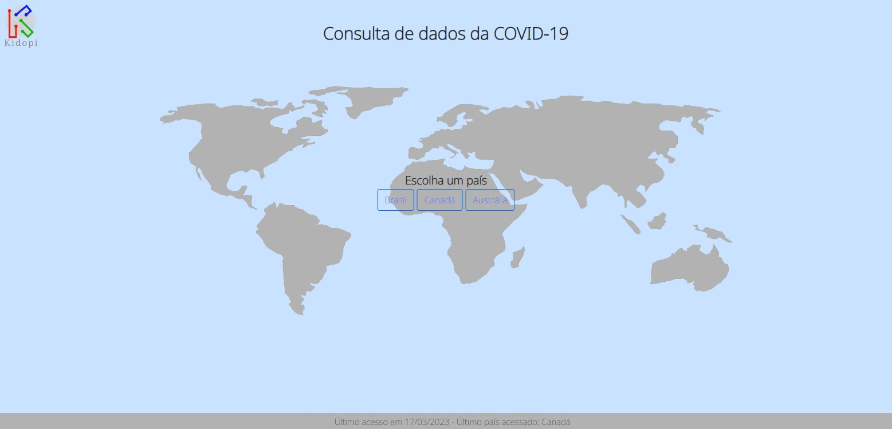
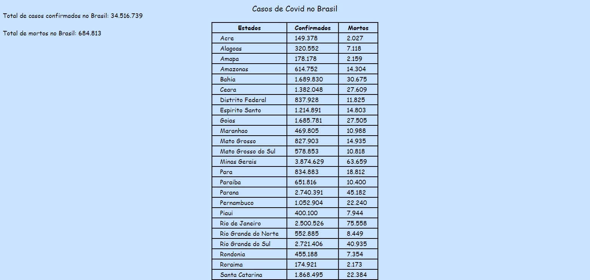
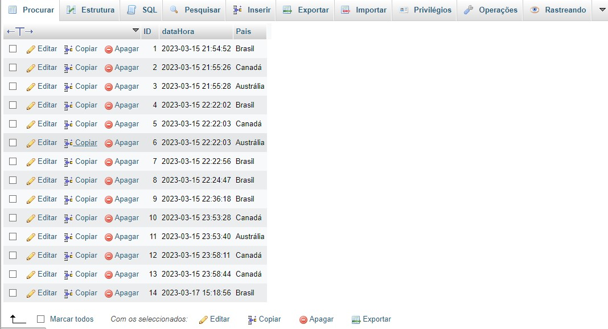

## Desafio Kidopi

 Desafio para o processo seletivo da Kidopi
 
 O projeto consiste na elaboração de uma interface web que tem como objetivo expor informações sobre a Covid-19 no mundo, utilizando a API da Kidopi para obter os dados  do Corona Virus. 
 
 Projeto realizado utilizando HTML, CSS e JS no Front-end e PHP no Back-end. 
 
 Link da API utilizada: https://dev.kidopilabs.com.br/exercicio/covid.php?listar_paises=1
 
 

  
 

  
  

  
